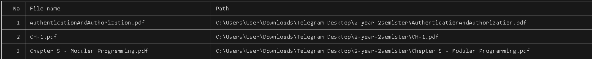
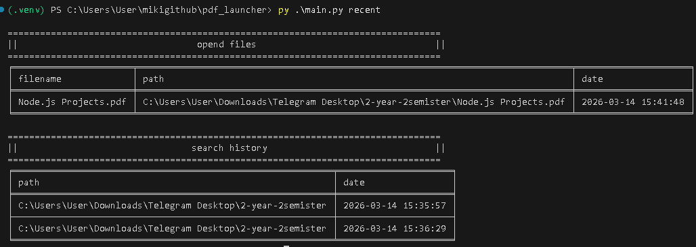

# PDF Launcher

A small command-line utility for opening and searching PDF files on Windows. The CLI normalizes paths to absolute paths and delegates file opening to the system default PDF viewer.

## Overview

PDF Launcher helps you:
- Open a PDF by path.
- Search a folder (recursively) for PDF files.
- View a history of opened files and searches.

## Features

- Open PDFs with the default Windows viewer.
- Recursive search for `.pdf` files in a directory.
- History tracking for opened files and search locations.
- Simple CLI with three subcommands: `open`, `search`, `recent`.

## Requirements

- Windows (uses `os.startfile`).
- Python 3.8+.
- Dependency: `tabulate==0.10.0` (see `requirements.txt`).

## Installation

Windows (recommended):

```powershell
python -m venv .venv
.\.venv\Scripts\Activate.ps1
pip install -r requirements.txt
```

## Usage

The CLI uses absolute paths internally. You can pass relative paths; they will be normalized by the parser.

Open a PDF:

```powershell
python main.py open "C:\path\to\file.pdf"
```

Search a folder for PDFs:

```powershell
python main.py search "C:\path\to\folder"
```

Show history:

```powershell
python main.py recent
```

Example output (search, formatting via `tabulate`):


Example output (recent, formatting via `tabulate`): 

**Note:** *this works if at last one open or search history exists*



## Data & History

History is stored in `data/history.json` and is updated when you open files or run searches. The `open` and `search` commands create the `data/` folder and `history.json` automatically if they are missing. The `recent` command only reads history; if the file is missing or contains invalid JSON, it prints an error and exits.

If you want to initialize history manually (for example, before running `recent`), you can create it like this:

```powershell
mkdir data
'{
  "opend files": [],
  "search history": []
}' | Out-File -Encoding utf8 data\history.json
```

The current schema uses these top-level keys (kept as-is for compatibility, including the legacy spelling):

- `opend files`: list of opened file records.
- `search history`: list of search records.

Example shape:

```json
{
  "opend files": [
    {
      "filename": "Report.pdf",
      "path": "C:\\docs\\Report.pdf",
      "date": "2026-03-12 20:37:22"
    }
  ],
  "search history": [
    {
      "path": "C:\\docs",
      "date": "2026-03-12 21:46:50"
    }
  ]
}
```

## Project Layout

```text
pdf_launcher/
├──  features/
|   ├──  history_manager.py
|   ├──  pdf_launcher.py
|    └──  pdf_searcher.py
├──  utils/
|    └──  input_validator.py
├──  cli.py
├──  main.py
├──  requirements.txt
├──  README.md
└──  data/             auto-created on open/search
     └──  history.json
```

## Limitations

- Windows-only: relies on `os.startfile`.
- `recent` requires `data/history.json` to exist and contain valid JSON; otherwise it prints an error.

## Roadmap / Improvements

- Add cross-platform open support (macOS `open`, Linux `xdg-open`).
- Create a proper package with a console entrypoint (`pdf-launcher`).
- Initialize and validate history storage automatically for `recent`.
- Add tests for validators, search, and history behavior.
